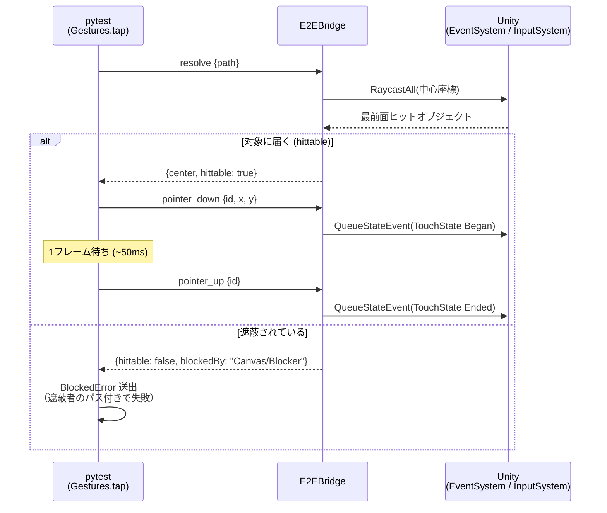

# E2EBridge プロトコル仕様 v1.0

## トランスポート

- TCP、行区切り JSON: 1 リクエスト = 1 行（LF 終端、UTF-8）、1 レスポンス = 1 行
- 複数クライアントの同時接続可（接続ごとに独立スレッドで応対。不正終了した接続が残っても
  新しい接続は塞がれない）。コマンド実行は全接続共通でメインスレッド直列処理（フレームと同期して実行）

### ポート設計

ブリッジの待ち受けポート解決順序（`BridgeHost.ResolvePort`）:

1. CLI 引数 `-e2eBridgePort <n>`
2. 環境変数 `UAPP_E2E_BRIDGE_PORT`
3. **Android実機/AVDのみ**: 起動 Intent の extra `uapp_e2e_port`
   （`run-e2e.ps1` が `e2e-config.json` の `devicePort` を `am start --ei uapp_e2e_port <n>` で渡す）
4. **エディタのみ**: プロジェクトの `e2e-config.json` の `editorBridgePort`
5. 既定 `13333`

- **デバイス（実機/AVD）**: `e2e-config.json` の `devicePort`（既定 13333）で待ち受け。
  **同一デバイスに計装アプリを複数入れる場合はアプリごとに別の devicePort を割り当てる**。
  ホストからは `adb -s <serial> forward tcp:<ホスト側ポート> tcp:<devicePort>` で接続
  （ホスト側ポートは `run-e2e.ps1 -HostPort` / `config/local.json` の `bridgePort`。
  複数 AVD の並行運用はターゲットごとに別のホスト側ポートを割り当てる）。
  Python ドライバへは環境変数 `UAPP_E2E_BRIDGE_PORT`（ホスト側）/ `UAPP_E2E_DEVICE_PORT`（デバイス側）で伝わる
  （`run-e2e.ps1` が設定。ドライバの `adb.forward()` はこの2つで再forwardする）
- **エディタ再生**: ホスト上で直接待ち受けるため adb 不要。複数エディタ（＝複数プロジェクト）
  同時運用は各プロジェクトの `editorBridgePort` で自然に分離される

ポート競合時の挙動: bind に失敗したブリッジは**2秒間隔で約60秒間リトライ**し、ポートが解放され次第
自己回復する（logcat に `[E2EBridge] bind failed ... リトライします` が出る）。
Intent extra なしで起動された場合（ランチャーアイコンからの手動起動等）は既定 13333 で待ち受けるため、
その状況で複数の計装アプリを同時起動すれば依然競合し得る。恒常運用は devicePort の分離で行うこと。

## エンベロープ

リクエスト:
```json
{"id": 1, "cmd": "resolve", "args": {"path": "StartButton"}}
```

レスポンス（成功 / 失敗）:
```json
{"id": 1, "ok": true, "result": { ... }}
{"id": 1, "ok": false, "error": {"code": "NOT_FOUND", "message": "object not found: 'StartButton'"}}
```

## 座標系

**Unity スクリーン座標**: 左下原点、ピクセル単位（`Screen.width/height` と同じ空間）。
Android ネイティブ座標（左上原点・物理ピクセル）へ変換が必要な場合は Y 軸反転＋スケールを
ホスト側で行う（`e2e_driver.adb.input_tap_unity_coords` 参照）。

## パス表記

- `"Canvas/Panel/StartButton"`: シーンルートからの絶対パス（`/` 区切り）
- `"StartButton"`（`/` なし）: 全シーンから名前検索。複数一致は `AMBIGUOUS` エラーで候補パスを返す
- 制限: 同名兄弟はパスでは区別できない（v1 では先勝ち）。dump の path で確認すること

## コマンド

### ping
疎通確認と環境情報。
```json
→ {"cmd": "ping"}
← {"bridge": "1.0", "app": "com.uapp.e2esample", "unity": "6000.3.6f1",
   "screen": {"w": 1080, "h": 2400}, "activePointers": 0, ...}
```

### dump
UI 階層をツリー JSON で返す。AI がテストを書くための「地図」。
```json
→ {"cmd": "dump", "args": {"scope": "ui", "probe": "selectable"}}
```
- `scope`: `"ui"`（ルートCanvas配下、既定）| `"all"`（全シーンルート）
- `path`: 指定するとそのサブツリーのみ
- `probe`: hittable 判定の対象。`"selectable"`（Button等のみ、既定）| `"all"` | `"none"`

ノード形式:
```json
{"name": "StartButton", "path": "Canvas/StartButton", "active": true,
 "components": ["RectTransform", "Image", "Button"],
 "rect": {"x": 240, "y": 180, "w": 300, "h": 100}, "center": {"x": 390, "y": 230},
 "interactable": true, "raycastTarget": true,
 "hittable": false, "blockedBy": "Canvas/Blocker",
 "children": [ ... ]}
```
トップレベルは `{"screen": {...}, "scene": "SampleScene", "nodes": [...]}`。

### resolve
単一オブジェクトの位置と到達可能性。
```json
→ {"cmd": "resolve", "args": {"path": "StartButton"}}
← {"path": "Canvas/StartButton", "active": true,
   "rect": {...}, "center": {"x": 390, "y": 230},
   "hittable": true}
```
- `hittable`: その中心座標を実タッチしたとき対象（またはその子孫）に届くか。
  `EventSystem.RaycastAll` の最前面ヒットで判定
- `blockedBy`: 遮られている場合の遮蔽オブジェクトのパス。特殊値:
  `"INACTIVE"`（非アクティブ）/ `"NOTHING_HIT"` / `"NO_EVENTSYSTEM"`
- 非 RectTransform オブジェクトは `center`（メインカメラ基準）のみ。hittable 判定は UI 専用

### get
コンポーネントの public プロパティ/フィールドを読む（状態アサーション用）。
```json
→ {"cmd": "get", "args": {"path": "ButtonA", "component": "HoldStateReporter", "property": "isHeld"}}
← {"value": true}
```
値の型: プリミティブ/string はそのまま、enum は文字列、Vector2/3・Color はオブジェクト、
その他は `ToString()`。コンポーネントが無い場合はエラーメッセージに搭載コンポーネント一覧を含む。

### pointer_down / pointer_move / pointer_up
マルチタッチプリミティブ。`pointerId`（クライアント任意の整数）ごとに 1 本の指を表す。
```json
→ {"cmd": "pointer_down", "args": {"pointerId": 1, "x": 390, "y": 230}}
→ {"cmd": "pointer_move", "args": {"pointerId": 1, "x": 400, "y": 300}}
→ {"cmd": "pointer_up",   "args": {"pointerId": 1}}
← {"pointerId": 1, "x": 390, "y": 230, "activePointers": 1}
```
- 実装: `InputSystem.QueueStateEvent`（Touchscreen / TouchState）。実タッチと同じパイプラインを通る
- down 済み ID への down は `POINTER_ALREADY_DOWN`、未 down の move/up は `POINTER_NOT_DOWN`
- **注意**: down と up の間は最低 1 フレーム空けること（クライアント側で ~50ms 待つ）。
  同一フレームに Began と Ended が入るとクリック判定されないことがある

### pointer_reset
アクティブな全ポインタを強制解放（テスト間クリーンアップ用）。
```json
→ {"cmd": "pointer_reset"}
← {"released": 2}
```

### ngui_event（NGUI搭載アプリのみ）
`UICamera.Notify` によるフレームワークレベルのイベント送出。
**レガシー Input 構成の NGUI アプリ向け**（Touchscreen 注入が UICamera に届かないため）。
NGUI + New Input System 構成では通常の `pointer_*` を使うこと。
```json
→ {"cmd": "ngui_event", "args": {"path": "UI Root/BtnStart", "event": "click"}}
← {"path": "UI Root/BtnStart", "event": "click"}
```
- `event`: `"click"`（OnPress(true)→OnPress(false)→OnClick）| `"press"` | `"release"`
- 到達可能性は検証しない。クライアントは必ず事前に `resolve` の `hittable` を確認する
  （Python の `Gestures.ngui_tap` は検証込み）
- NGUI が存在しないビルドでは `NGUI_NOT_PRESENT` エラー

## NGUI 対応の意味論

NGUI はリフレクションで自動検出される（`ping` の `ngui` フィールドで確認可能）。

- **dump**: `scope: "ui"` は Canvas に加えて `UIRoot` ツリーを含む。NGUI 要素は `"ui": "ngui"` が付き、
  rect は `UIWidget.worldCorners`（コライダーのみのタッチ領域は bounds）から算出
- **hittable**: NGUI 自身のヒットテスト `UICamera.Raycast`（コライダーへの Physics レイキャスト、
  2D/3D 両対応）で判定。NGUI はコライダー（イベント受け手）とウィジェット（見た目）が
  親子に分かれる構成が多いため、**祖先・子孫の双方向**で「届いた」と判定する
- **interactable**: `UIButton.isEnabled`（UIButton がある場合のみ）
- **text**: `UILabel` / `UIInput` の `text` プロパティも取得対象

## タップの流れ（忠実性保証）

クライアントの `Gestures.tap` は必ず resolve で到達可能性を検証してから注入する。



## エラーコード

| code | 意味 |
|---|---|
| `BAD_REQUEST` | 引数不足・型不正・JSON 不正 |
| `UNKNOWN_COMMAND` | 未知の cmd |
| `NOT_FOUND` | オブジェクト/コンポーネント/プロパティが見つからない |
| `AMBIGUOUS` | 名前検索で複数一致（message に候補パス最大10件） |
| `POINTER_ALREADY_DOWN` / `POINTER_NOT_DOWN` | ポインタ状態の不整合 |
| `TIMEOUT` | メインスレッド 30 秒無応答 |
| `INTERNAL` | 予期しない例外（message にスタックトレース） |

## バージョニング

`ping.bridge` がプロトコルバージョン。後方互換の追加はマイナー扱い（フィールド追加は破壊変更としない）。
クライアントは未知フィールドを無視すること。
