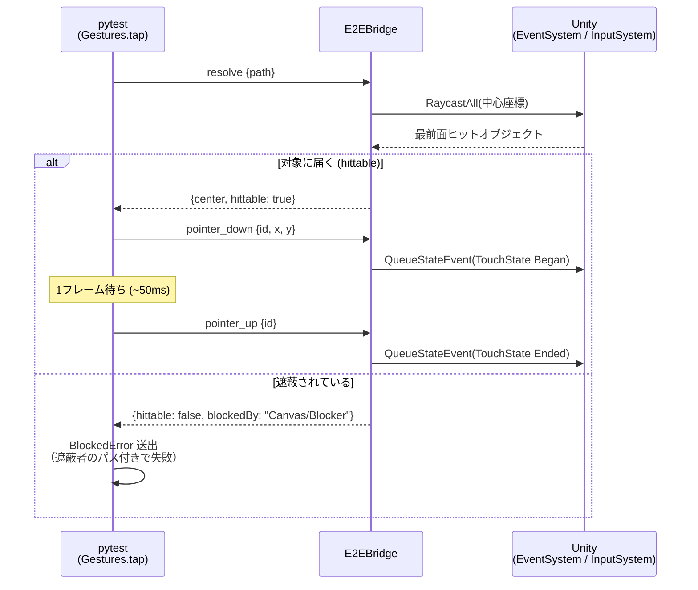

# E2EBridge プロトコル仕様 v1.0

## トランスポート

- TCP、行区切り JSON: 1 リクエスト = 1 行（LF 終端、UTF-8）、1 レスポンス = 1 行
- 複数クライアントの同時接続可（接続ごとに独立スレッドで応対。不正終了した接続が残っても
  新しい接続は塞がれない）。コマンド実行は全接続共通でメインスレッド直列処理（フレームと同期して実行）

### ポート設計

ブリッジの待ち受けポート解決順序（`BridgeHost.ResolvePort`）:

1. CLI 引数 `-e2eBridgePort <n>`
2. 環境変数 `UAPP_E2E_BRIDGE_PORT`
3. **Android実機/AVDのみ**: 起動 Intent の extra `uapp_e2e_port`
   （`run-e2e.ps1` が `e2e-config.json` の `devicePort` を `am start --ei uapp_e2e_port <n>` で渡す）
4. **エディタのみ**: プロジェクトの `e2e-config.json` の `editorBridgePort`
5. 既定 `13333`

いずれの経路も **1〜65535 のみ採用**（値域外は警告ログを出して次の候補へ。
Python ドライバ側の解決と挙動を揃え、片側だけフォールバックして接続先がズレる事故を防ぐ）。

- **デバイス（実機/AVD）**: `e2e-config.json` の `devicePort`（既定 13333）で待ち受け。
  **同一デバイスに計装アプリを複数入れる場合はアプリごとに別の devicePort を割り当てる**。
  ホストからは `adb -s <serial> forward tcp:<ホスト側ポート> tcp:<devicePort>` で接続
  （ホスト側ポートは `run-e2e.ps1 -HostPort` / `config/local.json` の `bridgePort`。
  複数 AVD の並行運用はターゲットごとに別のホスト側ポートを割り当てる）。
  Python ドライバへは環境変数 `UAPP_E2E_BRIDGE_PORT`（ホスト側）/ `UAPP_E2E_DEVICE_PORT`（デバイス側）で伝わる
  （`run-e2e.ps1` が設定。ドライバの `adb.forward()` はこの2つで再forwardする）
- **エディタ再生**: ホスト上で直接待ち受けるため adb 不要。複数エディタ（＝複数プロジェクト）
  同時運用は各プロジェクトの `editorBridgePort` で自然に分離される
- **`editorBridgePort` は「ホスト側の forward ポート」と別番号にする**
  （`config/local.json` の `bridgePort` / `run-e2e.ps1 -HostPort`）。**`devicePort` と分けるだけでは足りない** —
  ホスト側ポートは `devicePort` とは独立に決まり、**デバイス実行が張った forward は実行後も残って
  ホスト側ポートを adb が LISTEN し続ける**。同じ番号だと、次にエディタ直結を回したときに
  **エディタのつもりで端末のアプリへ転送される**（同じアプリが端末にも入っていれば「成功」してしまう）。
  ドライバは**`UAPP_E2E_EDITOR=1` を宣言した接続に限り**、接続直後に ping の `platform` を見て
  `WrongBridgeTargetError` で止める（**宣言の無い接続は検査されない**）。
  **踏まないのは番号を分けること**。`install-to-project.ps1`（導入時・local.json が無ければ既定で仮判定）と
  `run-e2e.ps1`（forward の直前・`-HostPort` 確定後なので誤検知なし）の両方が検査する
- **iOS シミュレータ（macOS のみ。kit 0.1.9 で配布キットに統合済み）**: `run-ios-e2e.ps1` /
  `build-ios.ps1` / `iosSimulatorPort` が該当。シミュレータのアプリは**ホストのポート名前空間で直接
  LISTEN する**（adb forward 相当は不要）。そのため `e2e-config.json` の `iosSimulatorPort` が
  実際に取り合いになる相手は **①起動中の他プロジェクトの iOS アプリの `iosSimulatorPort`
  ②全プロジェクトの `editorBridgePort` ③adb forward が握るホスト側ポート ④その他のホスト上の
  LISTEN 全部** — このどれとも別番号にする（`devicePort` 自体はデバイス内の別名前空間だが、
  慣例としてホスト側 forward ポートと同番号にするため、結果的に避けるのが安全）。
  ポートはアプリへ **`SIMCTL_CHILD_UAPP_E2E_BRIDGE_PORT` 環境変数**で渡す（`run-ios-e2e.ps1` が設定。
  `simctl launch` の後置引数はプロセスの argv には届くが Unity の managed 側からは見えない。
  2026-08-05 実測）。起動 Intent 相当の経路は無いので、解決順序は 2（環境変数）→ 5（既定）になる。
  ドライバは **`UAPP_E2E_IOS=1` を宣言した接続に限り** ping の `platform` が `IPhonePlayer` で
  あることを検査し、違えば `WrongBridgeTargetError` で止める（エディタ直結ガードと同じ約束。
  宣言の無い接続は検査されない。`UAPP_E2E_EDITOR` との同時宣言は接続前に明示エラー）。
  adb を使う操作は `UAPP_E2E_IOS=1` では明示エラーになる（Android 端末の誤検証防止）
- **iOS 実機のポート（同じく kit 0.1.9 で統合済み）**: 実機はシミュレータと違い
  ホストから直接届かないので、**`iproxy <ホスト側>:<デバイス側> -u <UDID>` で USB トンネル**を張る
  （Android の `adb forward` と同じ役割）。デバイス側は `iosSimulatorPort` を流用し、
  **ホスト側は既定で `iosSimulatorPort + 10`**（`-HostPort` で変更可）。
  ポートの渡し方は**版で変わる**: iOS 17 以降は **`DEVICECTL_CHILD_UAPP_E2E_BRIDGE_PORT`**
  （`SIMCTL_CHILD_` と同型の接頭辞）、iOS 16 以前は `idevicedebug --env UAPP_E2E_BRIDGE_PORT=…`。
  **無いと既定 13333 で待ち受けて設定と食い違う**
- **OS レイヤーエージェントのポート（同上）**: XCUITest ランナーの HTTP は**デバイス側 8200**
  （`-OsAgentPort`）で待ち受け、**実機ではホスト側 `+1`（既定 8201）**へ iproxy でトンネルする。
  ブリッジのポートとは別系統なので、**ホスト上の他の LISTEN とも別番号**にすること
- **Python ドライバ側の接続先解決**（`BridgeClient` / `resolve_port`）: 明示引数 >
  環境変数 `UAPP_E2E_BRIDGE_PORT` > カレントディレクトリから親方向に探索した
  `e2e-config.json` の `editorBridgePort` > 既定 13333。
  ポート未指定の `BridgeClient()` はエディタ直結の設定と自動で一致する
  （デバイス向けの pytest は forward したホスト側ポートに固定され、iOS シミュレータ向けは
  `run-ios-e2e.ps1` が `UAPP_E2E_BRIDGE_PORT` に `iosSimulatorPort` を渡すため影響しない）

ポート競合時の挙動: bind に失敗したブリッジは**2秒間隔で約60秒間リトライ**し、ポートが解放され次第
自己回復する（logcat に `[E2EBridge] bind failed ... リトライします` が出る）。
Intent extra なしで起動された場合（ランチャーアイコンからの手動起動等）は既定 13333 で待ち受けるため、
その状況で複数の計装アプリを同時起動すれば依然競合し得る。恒常運用は devicePort の分離で行うこと。

## エンベロープ

リクエスト:
```json
{"id": 1, "cmd": "resolve", "args": {"path": "StartButton"}}
```

レスポンス（成功 / 失敗）:
```json
{"id": 1, "ok": true, "result": { ... }}
{"id": 1, "ok": false, "error": {"code": "NOT_FOUND", "message": "object not found: 'StartButton'"}}
```

## 座標系

**Unity スクリーン座標**: 左下原点、ピクセル単位（`Screen.width/height` と同じ空間）。
Android ネイティブ座標（左上原点・物理ピクセル）へ変換が必要な場合は Y 軸反転＋スケールを
ホスト側で行う（`e2e_driver.adb.input_tap_unity_coords` 参照）。

## パス表記

- `"Canvas/Panel/StartButton"`: シーンルートからの絶対パス（`/` 区切り）
- `"StartButton"`（`/` なし）: 全シーンから名前検索。複数一致は `AMBIGUOUS` エラーで候補パスを返す
- **同名の兄弟は添字で区別する**: `"Canvas[1]/Panel/Close"`。
  **同名が 2 つ以上あるときだけ** dump が添字を付ける（一意な名前のパスは従来どおり）。
  添字は「同じ親の下の同名兄弟の中で何番目か」（0 始まり・階層順）。ルート同士の同名も同様に付く。
  添字を省くと先頭に解決される（`"Canvas/Panel"` ＝ `"Canvas[0]/Panel"`）
- **dump が返したパスは必ずそのまま resolve できる**（表記と解決を一致させるのが最優先）。
  実プロジェクトでは `Canvas` が複数あるのが普通で、添字が無いとどれを指すのか決まらない

## コマンド

### ping
疎通確認と環境情報。
```json
→ {"cmd": "ping"}
← {"bridge": "1.0", "app": "com.uapp.e2esample", "unity": "6000.3.6f1",
   "platform": "Android", "project": null, "scene": "SampleScene",
   "screen": {"w": 1080, "h": 2400}, "activePointers": 0, ...}
```
`scene` はアクティブシーン名。**「遷移を待つ」ポーリングは dump ではなく ping で回せる**
（全ツリーを取らないぶん間隔を詰めやすい。導入先要望で追加）。
`platform` は `Application.platform`（エディタなら `OSXEditor` / `WindowsEditor` / `LinuxEditor`）。
**`UAPP_E2E_EDITOR=1` が宣言されているときに限り**、ドライバは接続直後にこれを見て、
エディタ以外へ繋がっていたら `WrongBridgeTargetError` で止める
（`connect()` が疎通確認で叩く ping の結果を流用するので往復は増えない）。デバイス実行が残した `adb forward` が `editorBridgePort` と同じ番号を握ると、
エディタのつもりで端末のアプリを検証してしまうため。**宣言の無い接続は検査されない** —
手動でエディタへ繋ぐときも `UAPP_E2E_EDITOR=1` を付ける（`adb` の使用ガードと同じ約束）。

`project` は**エディタのときだけ**返るプロジェクトルートの絶対パス（`dataPath` の親。
プレイヤーでは `null`）。**`platform` だけでは「どのプロジェクトのエディタか」が分からない** —
2 つのプロジェクトの `editorBridgePort` が同じ番号だと、先に Play した側がポートを握り、
後発は bind に失敗して待つ。この状態で後発のテストを回すと**先着のエディタへ繋がったまま
緑になりうる**（UI が似ていれば気づけない。issue #26）。そこでドライバは
`UAPP_E2E_EDITOR=1` の接続に限り、この値と**期待するプロジェクト**
（`UAPP_E2E_PROJECT_PATH` → `e2e-config.json` のあるツリーから特定）を照合する。
**どちらかが欠けても止める**（fail-closed。確かめられなかったものを一致扱いにすると
ガードが有名無実になる）。**`project` は後から追加したので、古い計装のままでは止まる** —
その場合は導入先で再ビルドする。

### screenshot

```
→ {"cmd": "screenshot", "args": {"maxWidth": 720}}   # maxWidth は省略可（既定: 等倍）
← {"format": "png", "width": 720, "height": 1560, "bytes": 123456, "base64": "..."}
```

アプリ自身が画面を撮って PNG（base64）で返す。**外部ツールも特権も要らないので全経路で使える**が、
**限界と代償がある**ため、ドライバは既定でこのコマンドを使わない
（`UAPP_E2E_BRIDGE_SCREENSHOT=1` を宣言したときだけ）:

- **Unity の描画結果しか写らない**。ネイティブ WebView・システムダイアログ・ソフトキーボード・
  広告 SDK のビューは **Unity の描画パイプラインの外**にあるため欠ける（Unity 公式仕様）。
  **画面に出ているものを忠実に残したいなら OS 層のキャプチャを使う** — Android は
  `adb screencap`（ドライバの `adb.screencap()` / ジャーニー記録が既定で使う）、
  iOS はシミュレータが `simctl io`、実機は **iOS 16 以前なら `idevicescreenshot`**、
  **iOS 17 以降は OS レイヤーエージェント（自前の XCUITest ランナー）**
  （後者は端末側で「設定 → デベロッパ → UI オートメーションを有効」が要る）。
  **ただし iOS の実行経路と OS エージェントは配布キットに未収録**（開発リポジトリ側の実装）。
  **エディタ直結は OS 層ではなく Unity CLI 経由の撮影**で、Unity のフレームを撮る点はこのコマンドと
  同じ（ネイティブビューは写らない）。**このコマンドはそれらが使えない場合の代替**であって、
  上位互換ではない（撮影手段の選択順は docs/07-viewer.md の表）
- **撮る瞬間だけアプリのフレームにコストがかかる**。GPU の読み戻しは
  `CaptureScreenshotIntoRenderTexture` ＋ `AsyncGPUReadback` で非同期化し、`maxWidth` の縮小も
  読み戻し前に GPU 上で済ませてあるが、**PNG エンコード（メインスレッド）は残る**。
  影響の大きさは実プロジェクトの描画負荷と解像度に依存する
- **撮影中は後続コマンドを実行しない**（要求時と違う画面を撮らないための順序保証）。
  撮影中に来た 2 件目の screenshot は `INTERNAL` エラーで返す

**このコマンドは E2EBridge の追加なので、導入先は再ビルドが必要**（古い計装へ送ると
`UNKNOWN_COMMAND` になる。ドライバはその場合、画像なしで記録を続ける）。

### dump
UI 階層をツリー JSON で返す。AI がテストを書くための「地図」。
```json
→ {"cmd": "dump", "args": {"scope": "ui", "probe": "selectable"}}
```
- `scope`: `"ui"`（ルートCanvas配下、既定）| `"all"` / `"scene"`（**全ルート**）。
  **`DontDestroyOnLoad` 配下の常駐オブジェクトも列挙する**（`resolve` と同じ全ルート走査。
  以前は SceneManager の列挙だけを見ていたため、resolve では届くのに dump には出ないという
  食い違いがあった。常駐 UI は実プロジェクトの定石で、そこが空白地帯だと
  「dump を見てから書く」規約どおりに動く AI が発見できない）。
  常駐オブジェクトのノードには `"dontDestroyOnLoad": true` が付く
- `path`: 指定するとそのサブツリーのみ
- `probe`: hittable 判定の対象。`"selectable"`（Button等のみ、既定）| `"all"` | `"none"`

ノード形式:
```json
{"name": "StartButton", "path": "Canvas/StartButton", "active": true,
 "components": ["RectTransform", "Image", "Button"],
 "rect": {"x": 240, "y": 180, "w": 300, "h": 100}, "center": {"x": 390, "y": 230},
 "interactable": true, "raycastTarget": true,
 "hittable": false, "blockedBy": "Canvas/Blocker",
 "children": [ ... ]}
```
トップレベルは `{"screen": {...}, "scene": "SampleScene", "nodes": [...]}`。

### resolve
単一オブジェクトの位置と到達可能性。
```json
→ {"cmd": "resolve", "args": {"path": "StartButton"}}
← {"path": "Canvas/StartButton", "active": true,
   "rect": {...}, "center": {"x": 390, "y": 230},
   "hittable": true}
```
- `hittable`: その中心座標を実タッチしたとき対象（またはその子孫）に届くか。
  `EventSystem.RaycastAll` の最前面ヒットで判定
- `blockedBy`: 遮られている場合の遮蔽オブジェクトのパス。特殊値:
  `"INACTIVE"`（非アクティブ）/ **`"NOT_RAYCASTABLE"`** / `"NOTHING_HIT"` / `"NO_EVENTSYSTEM"`
- `blockedByComponents`: `blockedBy` が**パスのときだけ**付く、遮蔽者が持つコンポーネント型名の
  一覧（Transform 除く・重複なし。例: `["Image", "DialogShield"]`）。
  **「押して退けるものか・待つべきものか」を呼び手が機械判定するための材料**
  （導入先実測: 押しても退かないシールドを連打してしまった。パスの命名に依存せず、
  遮蔽者のクラス名で分岐できる）。種別の解釈はプロジェクト固有なので、ブリッジは
  事実だけを返し判断は呼び手に委ねる。dump のノードにも同じ規則で付く。
  ドライバの `BlockedError` は `blocked_by_components` 属性とメッセージ末尾でこれを持つ
- **`hittable: false` の理由は 3 通りあり、対処が違う**（混ぜると AI が無関係な対象を追う）:

  | 値 | 意味 | 対処 |
  |---|---|---|
  | 遮蔽オブジェクトのパス | 他の UI に覆われている | 先に閉じる / `wait_until_hittable` で待つ |
  | `NOT_RAYCASTABLE` | 対象（と子孫）に raycast を受ける要素が無い（`Graphic.raycastTarget` も Collider も無い） | **待っても永久に押せない**。指しているパスが間違っている |
  | `NOTHING_HIT` | その座標に何も無い（画面外・全要素が raycastTarget=false 等） | 座標・表示状態を疑う |

  判定は **`NOT_RAYCASTABLE` が最優先**（対象自身の性質なので、その場に何が居るかより確実）
- 非 RectTransform オブジェクトは `center`（メインカメラ基準）のみ。hittable 判定は UI 専用

### get
コンポーネントの public プロパティ/フィールドを読む（状態アサーション用）。
```json
→ {"cmd": "get", "args": {"path": "ButtonA", "component": "HoldStateReporter", "property": "isHeld"}}
← {"value": true}
```
値の型: プリミティブ/string はそのまま、enum は文字列、Vector2/3・Color はオブジェクト、
その他は `ToString()`。コンポーネントが無い場合はエラーメッセージに搭載コンポーネント一覧を含む。

### pointer_down / pointer_move / pointer_up
マルチタッチプリミティブ。`pointerId`（クライアント任意の整数）ごとに 1 本の指を表す。
```json
→ {"cmd": "pointer_down", "args": {"pointerId": 1, "x": 390, "y": 230}}
→ {"cmd": "pointer_move", "args": {"pointerId": 1, "x": 400, "y": 300}}
→ {"cmd": "pointer_up",   "args": {"pointerId": 1}}
← {"pointerId": 1, "x": 390, "y": 230, "activePointers": 1}
```
- 実装: `InputSystem.QueueStateEvent`（Touchscreen / TouchState）。実タッチと同じパイプラインを通る
- down 済み ID への down は `POINTER_ALREADY_DOWN`、未 down の move/up は `POINTER_NOT_DOWN`
- **注意**: down と up の間は最低 1 フレーム空けること（クライアント側で ~50ms 待つ）。
  同一フレームに Began と Ended が入るとクリック判定されないことがある

### pointer_reset
アクティブな全ポインタを強制解放（テスト間クリーンアップ用）。
```json
→ {"cmd": "pointer_reset"}
← {"released": 2}
```

### key_down / key_up / mouse_* / pad_*（UI を経由しない入力）

**UI の当たり判定を通らない入力**（キーボード・マウス・ゲームパッド）を注入する。
「何かキーが押された」「パッドのボタンが押された」「マウスでクリックされた」を直接見ている
ゲームコードは `tap(path)` では動かせないので、こちらを使う。

```json
→ {"cmd": "key_down",        "args": {"key": "space"}}         ← Key 列挙名（space / w / escape / f1 …）
→ {"cmd": "key_up",          "args": {"key": "space"}}
→ {"cmd": "mouse_move",      "args": {"x": 540, "y": 1200}}
→ {"cmd": "mouse_down",      "args": {"button": "left", "x": 540, "y": 1200}}   ← 座標は任意
→ {"cmd": "mouse_up",        "args": {"button": "left"}}       ← left / right / middle
→ {"cmd": "mouse_scroll",    "args": {"dx": 0, "dy": 120}}
→ {"cmd": "pad_button_down", "args": {"button": "buttonSouth"}} ← South / A / Cross でも可
→ {"cmd": "pad_button_up",   "args": {"button": "buttonSouth"}}
→ {"cmd": "pad_stick",       "args": {"stick": "left", "x": 0, "y": 1}}  ← -1〜1 に丸める
→ {"cmd": "input_reset"}                                       ← 押しっぱなしを全解除＋無効化デバイスの再有効化
← {"released": 2, "reenabledDevices": 0}
→ {"cmd": "input_devices"}
← {"devices": [{"name": "E2EVirtualGamepad", "layout": "Gamepad", "virtual": true, "current": true}, …],
   "editorFocusOverride": false,
   "virtualDevices": [{"kind": "keyboard", "name": "E2EVirtualKeyboard", "created": true},
                      {"kind": "mouse",    "name": "E2EVirtualMouse",    "created": false},
                      {"kind": "gamepad",  "name": "E2EVirtualGamepad",  "created": true}],
   "realGamepads": 0, "realKeyboards": 1, "realMice": 1}
```

- **注入先は専用の仮想デバイス**（`E2EVirtualKeyboard` / `E2EVirtualMouse` / `E2EVirtualGamepad`）。
  実デバイスに流すと、そのデバイス自身の報告（スティックのドリフト・人が触った操作・
  ドライバの定期送信）に上書きされ、テストが不安定に見える
- **仮想デバイスは種別ごとに初回注入時に生成される（遅延生成）**。一度も注入していない種別は
  `devices` に出てこないが、**実機に注入しているわけではない**。生成済みかどうかは
  `virtualDevices` の `created` で分かる（注入前に `devices` を名前で引くコードは
  `KeyError: 'E2EVirtualMouse'` になる。導入先で実際に踏まれた）
- **`input_devices` で実機の接続状況が分かる**。エディタ実行の PC には本物のキーボードやパッドが
  同時に居る。人が触れば `current` を奪われるので、原因不明の不安定さにしないために可視化する
- **レガシー入力バックエンド（Input Manager のみ）では届かない** → `INPUT_BACKEND_LEGACY` で明示的に失敗する
  （黙って無反応だと、AI はアプリ側のバグを疑って延々と調べる）
- **エディタ再生では、初回注入時に Input System の設定を自動で切り替える**
  （`editorInputBehaviorInPlayMode=AllDeviceInputAlwaysGoesToGameView` /
  `backgroundBehavior=IgnoreFocus` / `Application.runInBackground=true` の 3 点セット。
  再生終了時に元へ戻す）。既定設定のままだと、**Game view が Scene view 等にフォーカスを
  奪われている間、Pointer / Keyboard のイベントは Editor 更新でしか処理されない** —
  アクション駆動の uGUI は動くのに、`wasPressedThisFrame` 等をポーリングするコードには
  一切届かないという分かりにくい形で壊れる（導入先で実際に発生。OS のウィンドウフォーカスは
  無関係で、エディタ内のビュー間フォーカスだけが効く）。適用状態は `input_devices` の
  `editorFocusOverride` で確認できる
- **`input_reset` は復旧路を兼ねる**: 無効化されたままのデバイスを再有効化する（`reenabledDevices`）。
  **対象は E2E が注入に使うデバイスだけ**＝ブリッジの仮想デバイス（`E2EVirtual*`）と、
  タッチの注入先である `Touchscreen`。実機のキーボード・マウス・パッドは E2E が使わないので触らない
  （アプリが意図的に無効化している可能性があるものを後始末コマンドが勝手に起こさない）。
  センサー類も「既定で無効」が正常なので対象外。触られなかったデバイスの状態は
  `input_devices` の `enabled` で分かる（戻したければ Play を再起動する）
- 押した状態はブリッジ側が保持する（複数キーの同時押しが崩れないため）。
  テストの後始末に `input_reset` を呼ぶ
- down と up の間は最低 1 フレーム空ける（`pointer_*` と同じ理由。ドライバ側で ~50ms 待つ）

### ngui_event（NGUI搭載アプリのみ）
`UICamera.Notify` によるフレームワークレベルのイベント送出。
**レガシー Input 構成の NGUI アプリ向け**（Touchscreen 注入が UICamera に届かないため）。
NGUI + New Input System 構成では通常の `pointer_*` を使うこと。
```json
→ {"cmd": "ngui_event", "args": {"path": "UI Root/BtnStart", "event": "click"}}
← {"path": "UI Root/BtnStart", "event": "click"}
```
- `event`: `"click"`（OnPress(true)→OnPress(false)→OnClick）| `"press"` | `"release"`
- 到達可能性は検証しない。クライアントは必ず事前に `resolve` の `hittable` を確認する
  （Python の `Gestures.ngui_tap` は検証込み）
- NGUI が存在しないビルドでは `NGUI_NOT_PRESENT` エラー

## NGUI 対応の意味論

NGUI はリフレクションで自動検出される（`ping` の `ngui` フィールドで確認可能）。

- **dump**: `scope: "ui"` は Canvas に加えて `UIRoot` ツリーを含む。NGUI 要素は `"ui": "ngui"` が付き、
  rect は `UIWidget.worldCorners`（コライダーのみのタッチ領域は bounds）から算出
- **hittable**: NGUI 自身のヒットテスト `UICamera.Raycast`（コライダーへの Physics レイキャスト、
  2D/3D 両対応）で判定。NGUI はコライダー（イベント受け手）とウィジェット（見た目）が
  親子に分かれる構成が多いため、**祖先・子孫の双方向**で「届いた」と判定する
- **interactable**: `UIButton.isEnabled`（UIButton がある場合のみ）
- **text**: `UILabel` / `UIInput` の `text` プロパティも取得対象

## タップの流れ（忠実性保証）

クライアントの `Gestures.tap` は必ず resolve で到達可能性を検証してから注入する。



## エラーコード

| code | 意味 |
|---|---|
| `BAD_REQUEST` | 引数不足・型不正・JSON 不正 |
| `UNKNOWN_COMMAND` | 未知の cmd |
| `NOT_FOUND` | オブジェクト/コンポーネント/プロパティが見つからない（**コンポーネント名・プロパティ名の誤りでは message に候補を列挙する**: `available: …`） |
| `AMBIGUOUS` | 名前検索で複数一致（message に候補パス最大10件） |
| `POINTER_ALREADY_DOWN` / `POINTER_NOT_DOWN` | ポインタ状態の不整合 |
| `TIMEOUT` | メインスレッド 30 秒無応答 |
| `INTERNAL` | 予期しない例外（message にスタックトレース） |

## バージョニング

`ping.bridge` がプロトコルバージョン。後方互換の追加はマイナー扱い（フィールド追加は破壊変更としない）。
クライアントは未知フィールドを無視すること。
