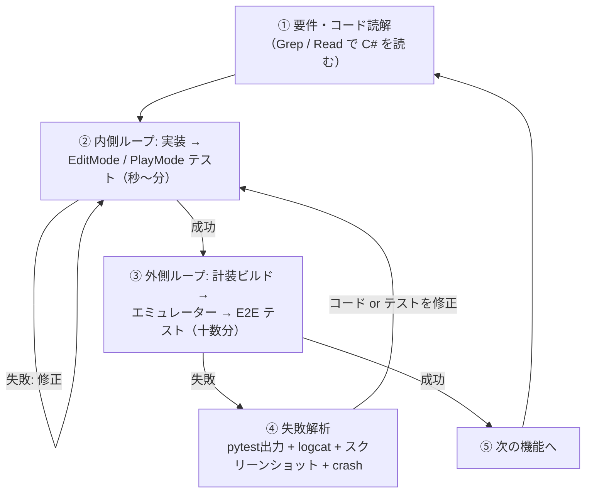

# AIループ開発ガイド（導入先プロジェクト用）

AIエージェント（Claude Code / Codex 等）がこの E2E 基盤を使ってアプリを自律開発するための手順書。
テスト規約の要約は `uapp_e2e/CLAUDE.md`、コマンド詳細は各スキル
（`.claude/skills/e2e-*` および `.agents/skills/e2e-*`。内容は同一）にある。

**最速の検証ループはエディタ直結**: Unity CLI＋Unity 6 以降なら `scripts/run-e2e.ps1 -Editor` が
シーン→Game view解像度→Play→pytest→Play終了まで全自動（ビルド・デバイス・adb 不要）。
実機依存の検証（logcat・adbタップ・実機描画）だけデバイス実行に回す。

## 全体ループ



**原則: ロジックは②で検証し尽くし、③は導線・入力・描画の検証に絞る。**
Android ビルドは1回十数分かかるため、③を回す頻度が高いとループが破綻する。

## 内側ループ（エディタ内テスト・ビルド不要）

```powershell
.\uapp_e2e\scripts\run-unity-tests.ps1 -Mode EditMode
.\uapp_e2e\scripts\run-unity-tests.ps1 -Mode PlayMode -Filter <テスト名の一部>
```

- **同じプロジェクトをエディタで開いたままだと実行できない**（排他ロックのため exit=6 で
  結果XMLが出ない）。エディタを閉じてから回すこと
- Unity CLI があればそれを、無ければ Unity 本体の `-batchmode -runTests` を自動で使う
  （エディタは `uapp_e2e/config/local.json` の editorRoots ＋ `ProjectVersion.txt` から解決）
- 結果は NUnit XML。**失敗テスト名・メッセージ・スタック先頭が要約表示される**ので、そこから修正対象へ直行する
- 終了ハング対策に `-TimeoutSeconds`（既定1800）で強制終了し、出力済みの結果XMLで判定する
- EditMode は既定で `-nographics`（グラフィックス初期化と USB スキャンを避ける。実行が数割速くなる）。
  描画が要る PlayMode は既定 OFF。明示指定は `-NoGraphics:$true` / `-NoGraphics:$false`（値が必須）
- ログは `Builds/test-<project>-<mode>.log` に確保される（既定の Editor.log は複数 Unity 同時実行で
  競合し、後発の実行がログを残せないことがあるため）
- **既知の制限**: Unity 2022.3 系では EditMode テストが完了しない事象を実測している（原因未特定。
  アセットインポートもライセンスも正常だが、テスト実行フェーズに入らないままタイムアウトする）。
  その場合は内側ループを諦め、E2E（外側ループ）で検証する
- テストが 0 件と警告が出たら、テストアセンブリ（`.asmdef` に `UnityEngine.TestRunner` /
  `nunit.framework.dll` 参照、`UNITY_INCLUDE_TESTS` 制約）と `-Filter` を確認する
- プロジェクトにテストアセンブリが無い場合、ロジックテストの新設はアプリ側の
  ビルド構成に影響するため、導入はユーザーに提案・確認してから行う

## 外側ループ（E2E）

```powershell
cd uapp_e2e
.\scripts\start-emulator.ps1     # 起動済みならスキップされる
.\scripts\build-android.ps1      # Assets やアプリコードを変更した時のみ
.\scripts\run-e2e.ps1            # テストのみの変更なら -SkipInstall
```

エディタ再生中のアプリに対しては adb 不要で直接接続できる
（`BridgeClient()` が `e2e-config.json` の `editorBridgePort` を自動解決。
pytest は `$env:UAPP_E2E_EDITOR = "1"; pytest tests` で adb を迂回して流せる。
adb を直接使うテスト—logcat アサート・adb タップ—は対象外で明示エラーになるため `-k` で除外する。
ビルド不要なので外側ループの高速な代替になる。
ただし実機との差異があるため、最終確認はエミュレーター/実機で行う）。

## ジャーニー記録（画面把握・遷移・カバレッジの可視化）

画面ごとのボタン把握状況・画面遷移・テスト結果は `journey.json` に追記記録され、
自己完結 HTML レポートにできる（ユーザーへの説明・カバレッジの穴の発見に使う）。
**run-e2e.ps1 経由の実行では自動で `uapp_e2e\Builds\journey\` に記録され、テスト後に
`report.html` も更新される**（無効化は `-NoJourney`、出力先変更は `-JourneyDir`）。
pytest 直叩きの場合は `--journey <DIR>`（または環境変数 `UAPP_E2E_JOURNEY_DIR`）を付ける:

```powershell
cd uapp_e2e\driver
pytest tests --journey ..\Builds\journey
python -m e2e_driver.journey ..\Builds\journey    # → ..\Builds\journey\report.html
```

テスト側は `journey` フィクスチャを受け取り、画面の節目で capture する
（`--journey` なしの実行では no-op なので、通常の回帰実行に影響しない）:

```python
def test_open_option(g, journey):
    journey.capture("title", label="タイトル")   # dump＋スクショ＋ボタン抽出
    g = journey.wrap(g)                          # 以降の tap が操作ログ＝カバレッジになる
    g.tap("Canvas/OptionButton")
    g.wait_until_visible("OptionWindow")
    journey.capture("option", label="設定")      # 遷移 title→option が自動記録される
```

スキーマ・カバレッジ定義の詳細は `docs/07-viewer.md`。

## クリーンインストール・ブートストラップ（アプリ外の画面を含む前提づくり）

クリーンインストールで全テストを繰り返す運用では、アプリ導入直後の一度きりの導線
（利用規約・Web認証・アカウント作成・キャラ作成）を毎回自動で通す必要がある。ここは
**Unity の外**（ブラウザの認証ページ、Android の「アプリで開く」ダイアログ等）を含むため、
E2EBridge では届かない。`e2e_driver.adb` の**要素ベースのネイティブUI操作**を使う（座標非依存）:

```python
from e2e_driver import adb
adb.ui_tap(text="デバッグ用ゲスト登録", contains=True)   # uiautomatorのテキストで探してタップ
adb.ui_wait(class_name="android.widget.EditText")        # 入力欄の出現待ち
adb.current_focus()                                       # フォアグラウンドがchrome/自アプリかの判定
adb.uninstall(pkg); adb.install(apk)                      # クリーンインストール
```

要点:
- **座標で書かない**（解像度・レイアウト変化で壊れる）。`text`/`class_name`/`resource_id` で要素を指す
- Unity 画面は単一 SurfaceView で uiautomator から中身が見えない → そこは E2EBridge に切り替える
- **アプリのみのクリーンインストールでは認証Cookieが端末に残り自動ログインになることがある**。
  「新規作成が要る画面」と「自動ログインで飛ばせる画面」の両方を**出た画面だけ処理する状態機械**で書く
- アカウント名など一意制約のある入力は実行ごとにユニーク化する
- 通常スモークとは別枠にする（例: pytest マーカー＋オプトインのフラグ）。クリーンインストールは重い

## E2Eテストの書き方（規約）

`e2e-write-test` スキルの手順に従う。要点:

1. **dump を見てから書く**（推測で書かない）。ジャーニー記録（`Builds/journey/journey.json`）が
   あれば画面・ボタン・カバレッジの**索引**として先に読む。ただし過去のスナップショットなので
   使うパスは生 dump で最終確認する
2. 操作APIは `e2e-config.json` の `uiType` に従う（`ngui-legacy` は `ngui_tap` 系）
3. 待機は `wait_until_*` を使う。`time.sleep` は「待てる条件が存在しない」場合
   （物理値の安定待ち・「何も起きない」ことの確認）のみ例外とし、理由をコメントに書く
4. マルチタッチテストは logcat 例外アサートをセットにする
5. 描画検証はスクリーンショットを画像として読む

## 失敗解析の優先順位

1. pytest の失敗メッセージ（`BlockedError` は遮蔽者のパスを含む）
2. `uapp_e2e/Builds/failure/unity-logcat.txt` の例外スタック → 修正対象コードの特定に直結
3. `uapp_e2e/Builds/failure/screen.png` を画像として読む
4. **全テスト接続エラーなら `uapp_e2e/Builds/failure/crash.txt`**（ネイティブクラッシュはUnityタグに出ない）。
   `adb shell pidof <package>` が空ならプロセス死亡。アプリが生きていて接続だけ死んでいるなら
   エミュレーター疲弊を疑い `adb reboot`（リブート直後の起動は1〜2分置く）
5. dump を再取得して期待した UI 状態との差分を見る

判断基準: 失敗が「実ユーザーにも起きる」ならアプリを直す。「テストの前提が誤り」ならテストを直す。

## （任意）エージェント開発ダッシュボード連携

複数プロジェクト・複数タスクを並行で回すときのために、テスト・E2E・ビルドの結果を
**1 行だけ外部へ記録する**エミッタ（`uapp_e2e/scripts/emit-status.ps1`）を同梱している。

- **プロジェクト直下に `.agent-status/` があるとき（または環境変数 `UAPP_E2E_STATUS_DIR` が実在する
  ディレクトリを指すとき）だけ書く**。探索は `uapp_e2e` とその親の 2 階層まで。無ければ完全に
  何もしない＝**導入していない環境では挙動が一切変わらない**（ファイルも pytest の引数も増えない）
- 追加の依存は無い（PowerShell が NDJSON を追記するだけ。ダッシュボード本体は別リポジトリの任意ツール）
- 記録先: `run-unity-tests.ps1` → テスト結果 / `run-e2e.ps1` → E2E 件数と journey レポートのパス /
  `build-android.ps1` → ビルド結果。作業単位を分けたいときは `UAPP_E2E_UNIT_ID` を渡す
- 失敗は握りつぶすので、**連携が壊れてもテスト・ビルドの結果には影響しない**

## 開発時の注意

- `Assets/uapp_e2e/E2EBridge/` を変更したら `docs/02-protocol.md` と `driver/e2e_driver/` を必ず同期
- 計装は define があるビルドのみ有効。**本番ビルドに define を付けない**
- アプリへのテスト用フック（画面直行のディープリンク等）追加は有効な手段だが、
  本番コードに影響するためユーザーに提案・確認してから行う
- **導入先の既存ビルドスクリプトがCWD依存**（相対パスで兄弟バッチを呼ぶ・カレントディレクトリ前提の
  パス解決をする等）**の場合、AIハーネスやCIからの実行では壊れることがある**。
  真因の代表は **環境変数 `NoDefaultCurrentDirectoryInExePath=1`**（AIハーネス等のセキュリティ設定。
  cmd がカレントディレクトリの実行ファイルを探さなくなり、bat 内の `call 兄弟バッチ名` が
  「〜が認識されていません」で失敗する）。対処は、実行前にこの環境変数を一時的に外す
  （PowerShell: `Remove-Item Env:\NoDefaultCurrentDirectoryInExePath`）か、
  該当ステップを**絶対パス（.\ 付き）で再現する薄いスクリプト**に置き換える
